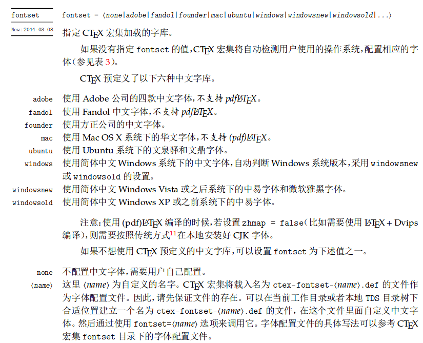

# 如何使用: 在线编译

本项目可以使用 ShareLaTeX 在浏览器中进行编辑和论文的编译, 但因为模板发布需要 Pro 账号, 账号需要收费, 因此 ShareLaTex 模板不再维护

## Latest Update: 2017/11/10

模板地址: [https://www.sharelatex.com/templates/5a03fcddc4aab43a4a6226e2](https://www.sharelatex.com/templates/5a03fcddc4aab43a4a6226e2)

项目地址: [https://www.sharelatex.com/project/5a03f5e84deb750e5512ccff](https://www.sharelatex.com/project/5a03f5e84deb750e5512ccff)

# 如何使用: 本地编译

本页面介绍如何在本地使用模板。

* [环境配置](#环境配置)
    * [字体](#字体)
    * [LaTeX 环境](#latex-环境)
        * [Linux](#linux)
        * [Windows](#windows)
        * [MacOS](#macos)
* [终端中克隆最新版](#终端中克隆最新版)
* [编译模板](#编译模板)
* [字数统计](#字数统计)

## 环境配置

本项目需要依赖 XeLaTeX 进行编译，因此需要 LaTeX 的运行环境。除此之外，SJTUThesis 使用 [CTeX](https://www.ctan.org/pkg/ctex?lang=en) 提供中文支持，共需要五种字体，分别是一套英文字体，和宋体、仿宋、黑体、楷体四种中文字体。

### 字体

[Tex Gyre Termes](http://www.ctan.org/tex-archive/fonts/tex-gyre/fonts/opentype/public/tex-gyre) 英文字体可以自行安装。

因为大部分操作系统对中文支持的方案都不同，因此本项目在 fonts/ 目录下有一套中文字体方案: 思源黑体, 思源宋体, Fandol 仿宋, Fandol 楷体。如果你不想安装中文字体可以直接使用 `fontset=source` 来使用预装好的字体。

除此之外, 还有很多选择: 具体可以参考 [CTeX 宏集说明](http://mirrors.rit.edu/CTAN/language/chinese/ctex/ctex.pdf)

<p align="center">
      <a></a>
</p>

其中 fandol 是开源字体，建议使用。Adobe 的中文字体 AdobeSongStd, AdobeKaitiStd, AdobeHeitiStd, AdobeFangsongStd 等。因为涉及版权，如果要使用请自行下载。

### LaTeX 环境

#### Linux

推荐 Linux 用户使用。

[TeX Live](https://www.tug.org/texlive/) 是 TeX 及其相关程序在 GNU/Linux 及其他类 Unix 系统、Mac OS X 和 Windows 系统下的⼀套发⾏版，因此可以访问其主页进行安装，安装过程可参考 [TeX Live - Quick install](https://www.tug.org/texlive/quickinstall.html)。

#### Windows

[CTeX 套装（包含完整版 MiKTeX）](http://www.ctex.org/CTeXDownload)是基于 Windows 下的 MiKTeX 系统，集成了编辑器 WinEdt 和 PostScript 处理软件 Ghostscript 和 GSview 等主要工具。 CTeX 中文套装在 MiKTeX 的基础上增加了对中文的完整支持。 CTeX 中文套装支持 CJK, xeCJK, CCT, TY 等多种中文 TeX 处理方式。

同时推荐 Windows 用户使用 [Babun](http://babun.github.io/) 作为命令行终端。Babun 已默认安装有这些工具：git(用于版本控制)、GNUmake(用于编译控制)、perl(用于字数统计)。

### MacOS

MacOS 用户可以安装 [MacTeX](https://www.tug.org/mactex/)。

## 终端中克隆最新版

```bash
git clone https://github.com/dyweb/SJTUThesis.git
```

如果之前有克隆过此模板但是想与 GitHub 上的最新版本同步，以`master`分支为例，执行以下命令更新到最新版。

```bash
git pull origin master
```

若是自己 fork 后克隆下来的，则执行以下命令。

```bash
git pull upstream master
```

## 编译模板

针对不同的系统和需求，需要修改 thesis.tex 文件：

```tex
% \documentclass[
%   bachelor|master|doctor,           % 必选项
%   fontset = {none|adobe|fandol|
%   founder|mac|ubuntu|windows|
%   windowsnew|windowsold|...},       % 字体选择，需要先安装对应字体
%   oneside|twoside,                  % 单面打印，双面打印(奇偶页交换页边距，默认)
%   openany|openright,                % 可以在奇数或者偶数页开新章|只在奇数页开新章(默认)
%   zihao=-4|5,                       % 正文字号：小四、五号(默认)
%   review,                           % 盲审论文，隐去作者姓名、学号、导师姓名、致谢、发表论文和参与的项目
%   submit                            % 定稿提交的论文，插入签名扫描版的原创性声明、授权声明
% ]
```

随后编译模板，生成学位论文PDF文件。GNUMake将调用`latexmk`程序，自动完成模板的多轮编译。

```bash
make pvc
```

定稿后可使用以下命令生成最终版本。

```bash
make clean thesis.pdf
```

若需要生成用于提交盲审的论文(隐去作者、导师等信息)，可在`thesis.tex`中为`sjtuthesis`文档类添加`review`选项。 若需要生成包含“原创性声明扫描件”和“授权书”签名扫描件的学位论文，请将扫描件分别保存为`pdf/origignal.pdf`和`pdf/authorization.pdf`，然后添加`submit`选项重新编译模板。

Windows 用户双击`compile.bat`即可完成编译过程，生成`thesis.pdf`，不依赖于 GNUMake，但推荐使用 GNUMake 的方式进行编译。

## 字数统计

运行如下命令:

```bash
make wordcount
```
